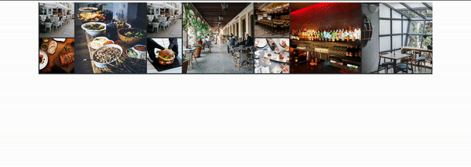

# Banner Gallery

A banner photo gallery web application for a restaurant listings page

[Demo](http://ec2-54-153-49-15.us-west-1.compute.amazonaws.com/)



## Related Projects

  - https://github.com/llaminati/Banner-Gallery
  - https://github.com/llaminati/Menu
  - https://github.com/llaminati/Reservations
  - https://github.com/llaminati/Reviews

## Table of Contents

1. [Usage](#usage)
1. [Requirements](#requirements)
1. [Development](#development)

## Usage

Create a file named config.js and place it within the db folder

**config.js**

```sh
module.exports = {
  connectionLimit: 10,
  user: \\CHOOSE_USERNAME,
  password: \\CHOOSE_PASSWORD,
  database: 'banner_images',
};
```

## Requirements

- Node 12.14.1
- MySQL 5.7

## Development

### Installing Dependencies

From within the root directory:

```sh
npm install
```

### Creating a database with schema

```sh
npm run create
```

### Seeding the database with photos

```sh
npm run seed
```

### Build webpack bundle and start server

```sh
npm run build
npm run start
```

### Launch site

After following all the steps above, open a browser and go to http://localhost:3001/